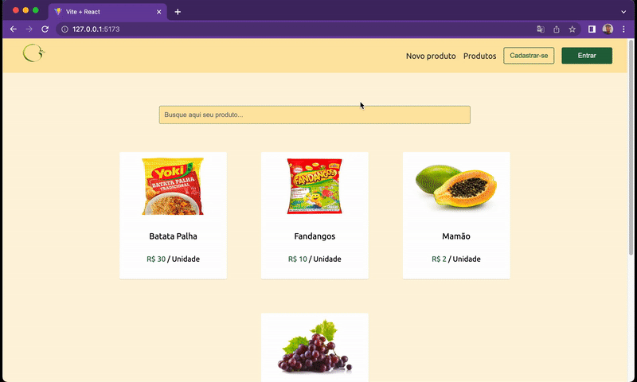

# <div align="center" ></div>

<p align="center">
 <a href="#-resumo-do-projeto"> Resumo </a> •
 <a href="#%EF%B8%8F-tecnologias-utilizadas">Tecnologias</a> • 
 <a href="#%EF%B8%8F-pré-requisitos"> Pré-requesitos</a> • 
 <a href="#-rodar-o-projeto"> Rodar projeto</a>
</p>

<br>
<p>🚀 Projeto criado durante os 2 meses de intensivo do Programadores do Amanhã.</p>
<p>💡 Utilizei a api criada neste projeto <a href="https://github.com/juvigh/E-commerce-API" target="_blank">aqui</a>, para obter as informações. </p>

<br>

## 🍏 Resumo do Projeto
<p> Consiste em um simples site ecommerce feito com React. A aplicação <strong>exibe</strong> produtos e é possível que o usuário consiga <strong>criar, editar, apagar</strong> e <strong>buscar</strong> esses produtos. É possivel, também, se registrar e logar no site. </p>



<br>

## 🛠️ Tecnologias utilizadas
<ul>
  <li><a href="https://reactjs.org/">React</a></li>
  <li><a href="https://axios-http.com/ptbr/docs/intro">Axios</a></li>
  <li><a href="https://styled-components.com">Styled Components</a></li>
  <li><a href="https://vitejs.dev">Vite</a></li>
</ul>

<br>

## ⚙️ Pré-requisitos
<p>Antes de começar, você vai precisar ter instalado em sua máquina as seguintes ferramentas:</p>
<ul>
  <li><a href="https://git-scm.com/">Git</a></li>
  <li><a href="https://nodejs.org/en/">Node.js</a></li>
  <li><a href="https://www.npmjs.com/">NPM</a></li>
  <li><a href="https://code.visualstudio.com">VSCode</a> - ou qualquer outro editor</li>
</ul>

<br>

## 🚀 Rodar o projeto

```
$ git clone https://github.com/juvigh/gaia-organicos.git
$ cd gaia-organicos
$ npm install
$ npm start
```
